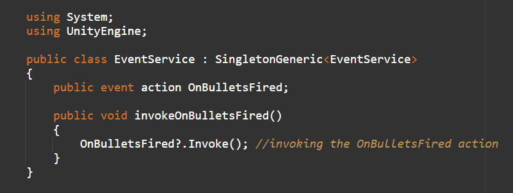
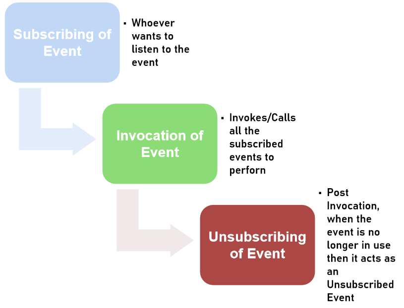
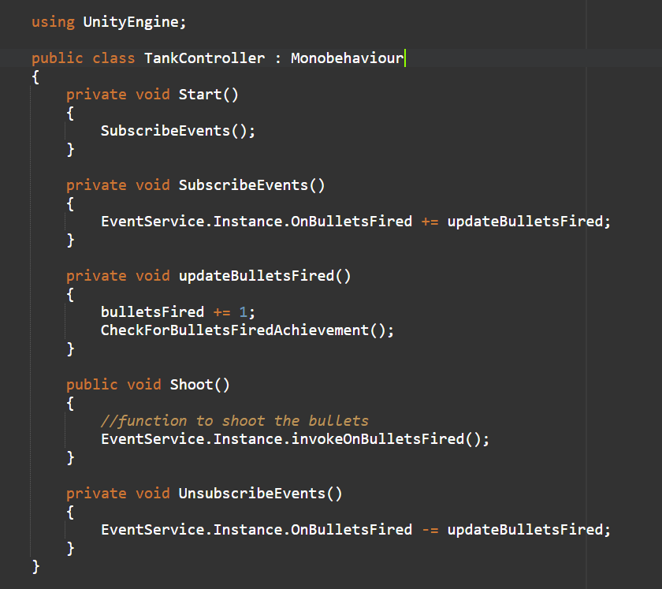

## 5. Achievement System

There are many achievements you can make. We will take an example of bullets fired achievement. 

There must be an event service to handle all the events of the achievement system.

like this - 

**Subscribing Event -** We are using SubscribeEvents() function to subscribe our updateBulletsFired() method to the OnBulletsFired event of the EventService script. We can subscribe to an event using the += operator. By subscribing a method to an event, we ensure that whenever the event occurs, our method will be called.

**Unsubscribing Event -** Similarly, we can unsubscribe an event using the -= operator. By unsubscribing a method, we ensure that our method is no longer called whenever the event occurs. If it is not done, then it can lead to memory leaks and errors in the game.

**Invoking an event -** We can invoke an event using the ?. operator. In the above example, it will invoke the OnBulletsFired event but it will only do it if there is something registered and it is not null.

In order to know how many bullets are fired, there must be a reference, right? As we have an event(OnBulletsFired), now we have to subscribe and unsubscribe a method to that event. Let’s see how we can do that.

Achievement System is a tool that allows developers to easily create and manage in-game achievements. Like this, you can make many different types of achievement systems for your game like- 

1. Enemy Waves
2. Scored Achievements
3. Collectible Achievements
4. Map area covered achievements
5. Player Progress Achievements, etc.

>💡 🚀 **[Join Discord Server](https://discord.gg/J5zDscnzms) → Get your doubts solved by experts instantly**
